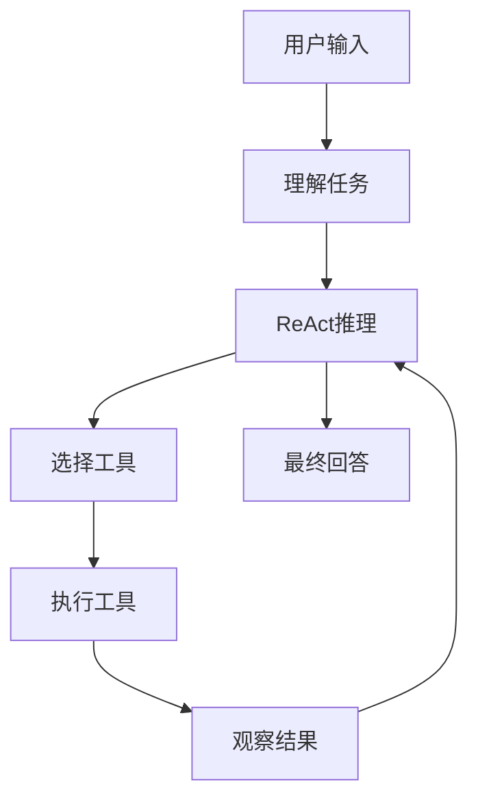

# 苏格拉底式教学增强模块

> 版本：1.0.0
> 依赖：mentor-guide >= 1.0.0
> 更新日期：2026-03-24

本文档定义 mentor-guide 的苏格拉底式教学增强功能，旨在提升引导深度、增强自适应能力、优化学习体验。

---

## 一、动态问题类型选择策略

### 1.1 问题类型定义

| 类型 | 适用场景 | 触发条件 | 示例 |
|:-----|:---------|:---------|:-----|
| **澄清型** | 基础概念、模糊表述 | Confused 状态、新手用户 | "你说的'智能'具体指什么？" |
| **假设探查** | 检验前提、推理逻辑 | Flow 状态、有一定理解 | "这个结论的前提是什么？" |
| **证据检验** | 批判性思维培养 | Flow/Bored 状态 | "有什么证据支持这个观点？" |
| **意图探索** | 预见后果、设计方案 | 项目型内容、Bored 状态 | "如果这样做，会有什么结果？" |
| **视角转换** | 拓展思维、跨领域连接 | 高级用户、延伸环节 | "从用户的角度看，这有什么不同？" |

### 1.2 热力计联动选择规则

```
if HeatMeter <= 30 (Confused):
    优先级: 澄清型 > 假设探查 > 其他
    策略: 连续使用澄清型直到状态改善

elif HeatMeter >= 70 (Bored):
    优先级: 意图探索 > 视角转换 > 证据检验
    策略: 增加挑战性，引导深入思考

else (Flow):
    按知识点类型自然轮换
    策略: 连续两个同类型后强制切换
```

### 1.3 轮换策略

```python
# 伪代码
last_question_types = []  # 最近2次问题类型

def select_next_question():
    available = all_types - set(last_question_types) if len(last_question_types) >= 2 else all_types
    
    # 根据热力计加权
    weights = calculate_weights(heat_meter, knowledge_point_type)
    
    # 选择最高权重的类型
    return weighted_select(available, weights)
```

---

## 二、实时自适应提问深度

### 2.1 深度层级定义

| 层级 | 类型 | 复杂度 | 问题示例 |
|:-----|:-----|:-------|:---------|
| **L1** | 定义/是什么 | 最低 | "Agent 是什么？" |
| **L2** | 原理/为什么 | 中 | "Agent 为什么需要记忆？" |
| **L3** | 应用/怎么做 | 高 | "如何设计一个 Agent 的记忆系统？" |
| **L4** | 迁移/还能用在哪 | 最高 | "这个记忆系统设计能用在其他场景吗？" |

### 2.2 理解置信度评估

每次用户回答后，隐式评估回答质量：

| 评估结果 | 判定条件 | 深度调整 |
|:---------|:---------|:---------|
| **正确** | 回答准确、完整 | 深度 +1 |
| **部分正确** | 方向对但细节有误 | 深度不变，追问细节 |
| **错误** | 理解偏差或完全错误 | 深度 -1，回溯引导 |
| **不知** | 无法回答或说"不知道" | 触发苏格拉底式错误恢复 |

### 2.3 深度跃迁规则

```
连续正确 L1 + L2 → 直接跳到 L3
连续错误 L3 + L4 → 回退到 L1/L2
部分正确 → 停留当前层级，追问细节
```

---

## 三、苏格拉底式错误恢复

### 3.1 帮助层级改造

将原有的 L1/L2/L3 帮助层级改造为"苏格拉底式阶梯"：

| 层级 | 名称 | 策略 | 示例 |
|:-----|:-----|:-----|:-----|
| **H1** | 角度转换 | 换个角度提问 | "如果把这个问题的条件反过来看，会怎样？" |
| **H2** | 问题拆解 | 拆成更小问题逐一引导 | "我们先不看整体，只看这一部分……它的作用是什么？" |
| **H3** | 示范留白 | 展示类似问题，留空补全 | "我这样做了第一步，接下来该怎么做？" |
| **H4** | 讲解模式 | 仅在用户明确要求时使用 | 直接讲解答案 |

### 3.2 错误恢复流程

```
用户卡住
    │
    ▼
H1: 角度转换
    │
    ├── 用户回答正确 → 返回正常提问
    │
    └── 用户仍卡住
            │
            ▼
        H2: 问题拆解
            │
            ├── 用户回答正确 → 返回正常提问
            │
            └── 用户仍卡住
                    │
                    ▼
                H3: 示范留白
                    │
                    ├── 用户回答正确 → 返回正常提问
                    │
                    └── 连续两次 H3 仍卡住
                            │
                            ▼
                        询问用户：
                        "是否希望我直接讲解？还是继续引导？"
                            │
                            ├── 讲解 → H4
                            └── 继续 → 返回 H2（换一个拆解角度）
```

---

## 四、追问链机制

### 4.1 追问链模板

```
用户回答正确
    │
    ▼
Q1: "你为什么这样想？"（探究推理过程）
    │
    ├── 用户给出理由
    │       │
    │       ▼
    │   Q2: "这个理由的假设是什么？"（检验前提）
    │       │
    │       ├── 用户确认假设
    │       │       │
    │       │       ▼
    │       │   Q3: "如果假设不成立，结论还成立吗？"（反例思考）
    │       │       │
    │       │       └── 若仍正确
    │       │               │
    │       │               ▼
    │       │           Q4: "这个概念和之前学的XX有什么联系？"（知识迁移）
    │       │
    │       └── 用户暴露漏洞 → 回溯到该知识点重新引导
    │
    └── 用户无法解释 → 触发 H1 帮助
```

### 4.2 追问链长度控制

| 用户水平 | 最大追问深度 | 说明 |
|:---------|:-------------|:-----|
| 新手 | 2 层 | 避免过度压力 |
| 有经验 | 3 层 | 适度深入 |
| 专家 | 4 层 | 充分挖掘 |

### 4.3 漏洞检测与回溯

```
if 追问中暴露理解漏洞:
    记录漏洞位置
    暂停当前追问链
    回溯到漏洞知识点
    从 L1 重新引导
    漏洞修复后，返回原追问链继续
```

---

## 五、可视化结合

### 5.1 自动触发条件

| 教学内容 | 可视化类型 | 触发关键词 |
|:---------|:-----------|:-----------|
| 流程/步骤 | Mermaid 流程图 | "流程"、"步骤"、"循环" |
| 时序/交互 | Mermaid 时序图 | "交互"、"对话"、"请求" |
| 架构/结构 | Mermaid 类图 | "架构"、"结构"、"组件" |
| 对比分析 | Markdown 表格 | "对比"、"区别"、"优缺点" |

### 5.2 可视化引导示例

**场景**：讲解 Agent 推理循环



**配套问题**：
1. "在这个流程中，哪一步最可能出错？"
2. "如果跳过'观察结果'直接输出，会发生什么？"
3. "如果让你优化这个循环，你会从哪一步入手？"

---

## 六、评估与反馈机制

### 6.1 问答记录格式

每次问答记录以下信息：

```json
{
  "timestamp": "2026-03-24T10:30:00Z",
  "milestone_id": "里程碑3",
  "knowledge_point": "Agent记忆系统",
  "question_type": "假设探查",
  "depth_level": "L2",
  "user_response_quality": "正确",
  "response_time_seconds": 45,
  "help_level_used": null,
  "follow_up_chain_depth": 2,
  "heat_meter_before": 65,
  "heat_meter_after": 70
}
```

### 6.2 里程碑结束报告

每个里程碑结束时，生成"理解深度报告"：

```markdown
## 里程碑 3 理解深度报告

### 知识点掌握情况

| 知识点 | 最高深度 | 追问链完整度 | 备注 |
|:-------|:---------|:-------------|:-----|
| Agent定义 | L3 | 3/4 | 迁移环节稍弱 |
| 记忆系统 | L2 | 2/3 | 应用层需加强 |
| 推理循环 | L4 | 4/4 | 完全掌握 |

### 错误恢复效率

| 知识点 | 卡住次数 | 恢复交互数 | 恢复方式 |
|:-------|:---------|:-----------|:---------|
| 记忆系统 | 2 | 3 | H2拆解 |

### 苏格拉底历史摘要

- 问题类型分布：澄清型 30% | 假设探查 40% | 证据检验 20% | 其他 10%
- 平均回答时间：38秒
- 帮助层级使用：H1 1次 | H2 2次 | H3 0次 | H4 0次

### 下阶段建议

- 加强应用层（L3）问题设计
- 适当增加证据检验型问题
- 保持当前追问深度
```

### 6.3 学习者画像更新

将苏格拉底历史写入学习者画像：

```markdown
## 苏格拉底历史

| 日期 | 里程碑 | 平均深度 | 追问完整度 | 恢复效率 |
|:-----|:-------|:---------|:-----------|:---------|
| 2026-03-24 | 里程碑3 | L3 | 75% | 高 |
```

---

## 七、与现有架构的集成

### 7.1 热力计联动

```
Heat Meter 变化
    │
    ├── Confused (≤30) → 优先澄清型 + 降低深度
    ├── Flow (31-69) → 自然轮换 + 保持深度
    └── Bored (≥70) → 增加挑战 + 提升深度
```

### 7.2 参数驱动

| 参数 | 影响 |
|:-----|:-----|
| 颗粒度 | 单个知识点的提问数量上限 |
| 练习密度 | 追问链触发频率 |
| 检查频率 | 理解置信度评估频率 |
| 里程碑大小 | 每个里程碑的深度报告生成 |

### 7.3 Delta-Write 集成

```
问答记录 → 追加到会话文件 ## 思考档案
理解深度报告 → 追加到会话文件 ## 教学复盘
苏格拉底历史 → 追加到学习者画像 ## 苏格拉底历史
```

---

## 八、实施优先级

### 第一阶段（快速见效）

- [x] 动态问题类型选择策略
- [x] 苏格拉底式错误恢复（H1/H2/H3/H4 阶梯）

### 第二阶段（深度提升）

- [ ] 实时自适应提问深度（L1-L4 层级）
- [ ] 追问链机制

### 第三阶段（体验优化）

- [ ] 可视化结合
- [ ] 评估与反馈机制

---

## 九、快速参考

### 问题类型速查

| 状态 | 推荐类型 | 避免 |
|:-----|:---------|:-----|
| Confused | 澄清型、假设探查 | 意图探索、视角转换 |
| Flow | 自然轮换 | 连续同类型 |
| Bored | 意图探索、视角转换 | 澄清型 |

### 深度层级速查

| 层级 | 关键词 | 触发条件 |
|:-----|:-------|:---------|
| L1 | 是什么 | 新知识点开始 |
| L2 | 为什么 | L1 正确后 |
| L3 | 怎么做 | L1+L2 连续正确 |
| L4 | 还能用在哪 | L3 正确 + 专家用户 |

### 帮助层级速查

| 层级 | 策略 | 使用时机 |
|:-----|:-----|:---------|
| H1 | 角度转换 | 首次卡住 |
| H2 | 问题拆解 | H1 无效 |
| H3 | 示范留白 | H2 无效 |
| H4 | 讲解模式 | 用户要求或 H3×2 无效 |
